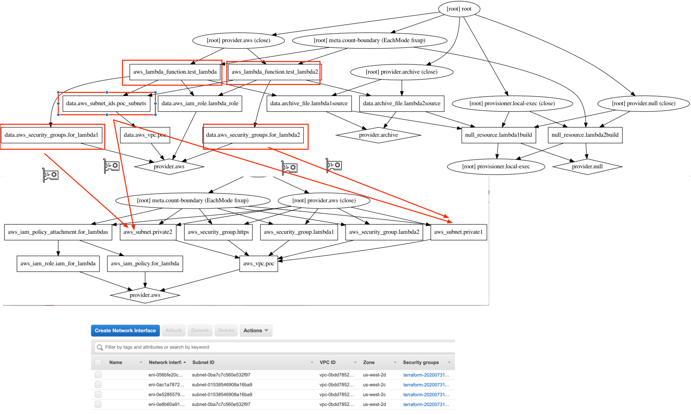

Note:
    utils/build_py_lambda.sh may need to be adjusted to use PIP if desired, now is using pip3
    
terraform/main.tf   lambda_role name need to be set for one in use

Foundation Deployment:

    cd tf_base
    terraform init
    terraform apply --auto-approve
        

Lambda's Deployment:
    
    cd terraform
    terraform init
    terraform apply --auto-approve
    
         
Results: multiple ENIs are created per unique [security_groups]:subnet combination per this doc
https://aws.amazon.com/blogs/compute/announcing-improved-vpc-networking-for-aws-lambda-functions/

**Note:** if we change configuration for lambdas to use exactly the same set of security groups, then only
2 ENIs will be created.

